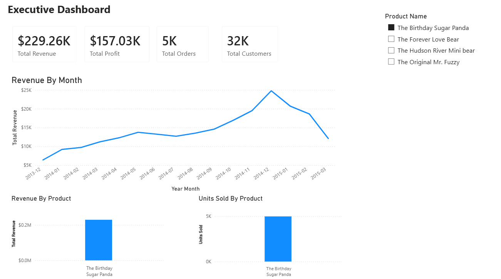
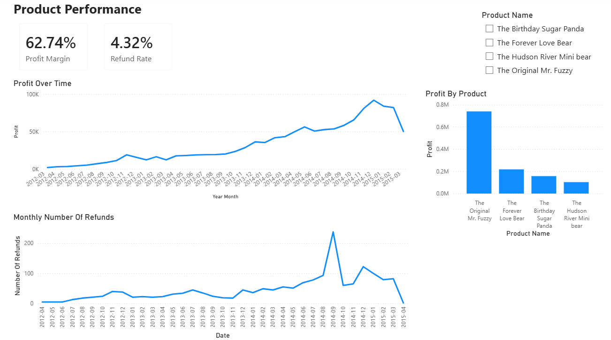
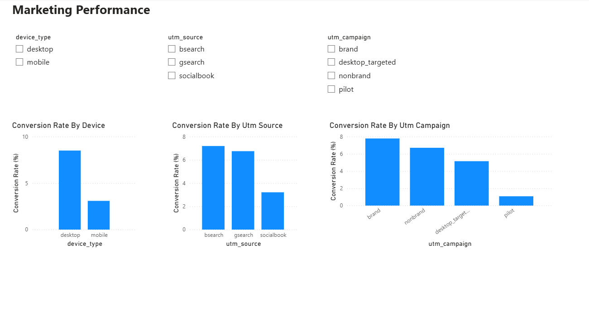

# E-commerce Sales Analysis

## Project Goal

Analyse an e-commerce dataset to identify trends and patterns in customer behaviour, product performance and marketing performance using SQL, Python and Power BI.

## Dataset

The dataset contained 7 related tables, including:

- 32,000 customer orders
- 40,000 individual purchased products
- 1,700 refunded orders
- 1,180,000 website pageviews
- 470,000 website sessions
- Dictionary providing context for each column
- Products table

## Workflow

- Import CSV datasets
- Clean and prepare data using pandas
- Identify the relationships and granularity between tables
- Write SQL queries to answer business questions
- Pandas for additional analysis and aggregations
- Create interactive dashboards in Power BI

## Tools Used

- Python
- Pandas
- NumPy
- Plotly Express
- SQLite
- SQL
- Power BI
- Jupyter Notebook

## Analysis Performed

The analysis was completed using a combination of SQL, Python (Pandas) and Power BI.

### SQL Analysis
- Calculated total revenue, profit and profit margin by product.
- Analysed monthly revenue and order trends.
- Calculated refund rates and total refund amounts for each product.
- Analysed customer purchasing behaviour and repeat customer rate.
- Investigated marketing performance by device type, traffic source and campaign.

### Python Analysis
- Imported SQL query results into Pandas for additional analysis.
- Created summary tables and calculated business metrics.
- Produced interactive visualisations using Plotly Express.
- Identified trends and patterns to support business recommendations.

### Power BI Dashboard
Developed a three-page interactive dashboard consisting of:
- Executive Dashboard
- Product Performance Dashboard
- Marketing Performance Dashboard

The dashboards include KPI cards, interactive slicers and visualisations to allow users to explore the data.

---

## Key Findings

- The Original Mr. Fuzzy generated the highest revenue and profit throughout the analysed period.
- The Birthday Sugar Panda had the highest refund rate (6.04%) despite being one of the newer products.
- Revenue and orders generally increased over the analysed period as additional products were introduced.
- Desktop users had more than double the conversion rate of mobile users.
- Gsearch generated the highest number of customer sessions and purchases.
- The Pilot campaign had the lowest conversion rate (1.05%), significantly lower than the other campaigns.
- Only 1.86% of customers placed more than one order, indicating a low repeat customer rate.

## Power BI Dashboard

### Executive Dashboard

### Product Performance Dashboard

### Marketing Performance Dashboard

